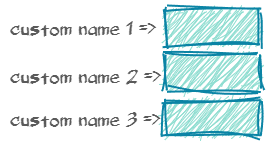

<p align="center"><a href="https://t-regx.com/"></a></p>

# Helper for PhpUnit @dataProvider

Handy `require-dev` testing tool for [PhpUnit]. It allows to manage data providers
with `zip()`, `join()`, `cross()`, `pairs()`, `slice()`, `map()` and more.

[][build]
[][coveralls]
[][repository]
[][license]
[][repository]

[][1]
[][1]
[][1]
[][1]
[][1]
[][1]
[][1]

[](https://github.com/t-regx/CrossDataProviders/pulls)

1. [Installation](#installation)
   * [Composer](#installation)
2. [Overview](#overview)
   * [`DataProvider::list()`](#dataproviderlist)
   * [`DataProvider::join()`](#dataproviderjoin)
   * [`DataProvider::zip()`](#dataproviderzip)
   * [`DataProvider::cross()`](#dataprovidercross)
   * [`DataProvider::pairs()`](#dataproviderpairs)
   * [`DataProvider::of()`](#dataproviderof)
   * [`DataProvider::tuples()`](#dataprovidertuples)
   * [`DataProvider::dictionary()`](#dataproviderdictionary)
   * [`DataProvider.map()`](#dataprovidermap)
3. [Documentation](#documentation)
   * [Functionalities](#functionalities)
   * [Features](#features)
   * [Example](#example-usage)
   * [Advanced example](#advanced-usage)
4. [Migration](#migration-from-previous-version)

# Installation

Installation for PHP 7.1 and later:

```bash
composer require --dev rawr/phpunit-data-provider
```

# Overview

`DataProvider` can be used to build, compose and edit data providers to be used with [PhpUnit]
by [@sebastianbergmann](https://github.com/sebastianbergmann).

### `DataProvider::list()`

`DataProvider::list()` provides a list of elements. Test is invoked each time with a single argument.

```php
/**
 * @test 
 * @dataProvider colors
 */
public function test(string $color): void {
  // your test here
}

public function colors(): DataProvider {
  return DataProvider::list('blue', 'yellow', 'red');
}
```


Additionally, `DataProvider::list()` [names](#names) rows based on values.

### `DataProvider::join()`

Vertically join data providers together.

💡 Useful when two data providers are used in other tests, and a new test should use both of them.

```php
/**
 * @test 
 * @dataProvider colors
 */
public function test(string $color, string $thing): void {
  // your test here
}

public function colors(): DataProvider {
  return DataProvider::join($this->blueColors(), $this->yellowColors(), $this->redColors());
}

public function blueColors(): DataProvider {
  return DataProvider::tuples(
    ['blue', 'sky'], 
    ['deep blue', 'ocean']
  );
}

public function yellowColors(): iterable {
  yield 'sun' => ['yellow', 'sun'];
}

public function redColors(): array {
  return [
    'apple' => ['red', 'apple']
  ];
}
```


Note:

- Only data provider with equal amounts of arguments in rows can be joined. `DataProvider.drop()` can be used to trim
  overflowing columns, or [`DataProvider::zip()`][zip] to widen data provider with less rows.

### `DataProvider::zip()`

Horizontally join data providers together.

💡 Useful for keeping data providers clean and simple.

```php
/**
 * @test 
 * @dataProvider colors
 */
public function test($blueColor, $blueThing, $adjective, Factory $factory): void {
  // your test here
}

public function colors(): DataProvider {
  return DataProvider::zip($this->blueThings(), $this->adjectives(), $this->factories());
}

public function blueThings(): DataProvider {
  return DataProvider::tuples(
    ['blue', 'ink'],
    ['light blue', 'shirt'],
    ['deep blue', 'ocean']
  );
}

public function adjectives(): iterable {
  return DataProvider::list('liquid', 'comfortable', 'majestic');
}

public function factories(): iterable {
  yield [new InkFactory()];
  yield [new ShirtFactory()];
  yield [new OceanFactory()];
}
```


Note:

- Only data provider with equal amounts of rows can be zipped. `DataProvider.slice()` can be used to trim overflowing
  rows, or [`DataProvider::join()`][join] to prolong a shorter data provider.

### `DataProvider::cross()`

Creates a square matrix of given data providers.

💡 Useful for testing all combinations of arguments.

```php
/**
 * @test 
 * @dataProvider colorsAndThings
 */
public function test(string $color, string $shade): void {
  // your test here
}

public function colorsAndThings(): DataProvider {
  return DataProvider::cross($this->colors(), $this->things());
}

public function colors(): array {
  return [
    ['blue'], ['yellow'], ['red']
  ];
}

public function things(): iterable {
  return DataProvider::list('sky', 'sun', 'apple');
}
```


### `DataProvider::pairs()`

Calls test with two arguments. Each argument is paired with all of the other arguments. All rows are [named](#names)
according to the arguments.

Example shows a test paring image formats:

```php
/**
 * @test
 * @dataProvider formats
 */
public function shouldConvertFile(string $from, string $to): void {
  // your test here
}

public function formats(): array {
  return DataProviders::distinctPairs('png', 'jpg', 'bmp');
}
```


### `DataProvider::of()`

Instantiates a `DataProvider` from a raw-array accepted by [PhpUnit].

```php
public function example(): DataProvider {
  return DataProvider::of($this->rawArray());
}

public function rawArrayDataProvider(): array {
  return [
    'key' => ['argument 1', 'argument 2']
  ];
}
```


### `DataProvider::tuples()`

Provide multiple arguments for each a test. `DataProvider::tuples()` [names](#names) each row based on the values.

```php
/**
 * @test 
 * @dataProvider colors
 */
public function test(string color, string $thing): void {
  // your test here
}

public function colors(): DataProvider {
  return DataProvider::tuples(
    ['blue', 'sky'], 
    ['yellow', 'sun'],
    ['red', 'apple']
  );
}
```


### `DataProvider::dictionary()`

Specify a single argument for test. [`DataProvider::dictionary()`][dictionary] [names](#names) each row based on the
provided array key.

```php
/**
 * @test 
 * @dataProvider colors
 */
public function test(string color): void {
  // your test here
}

public function colors(): DataProvider {
  return DataProvider::dictionary([
    'custom name 1' => 'blue',
    'custom name 2' => 'yellow',
    'custom name 3' => 'red'
  ]);
}
```



In most cases, [`DataProvider::list()`][list] or [`DataProvider::tuples()`][tuples] should be used to [name](#names)
rows based on arguments. Method `DataProvider::dictionary()` is useful when the arguments are not self-explanatory:

```php
public function ports(): DataProvider {
  return DataProvider::dictionary([
    'http'  => 80, 
    'https' => 443, 
    'ftp'   => 21  
  ]);
}
```

### `DataProvider.map()`

Transform each row's values in `DataProvider` to any other set of values.

💡 Useful for separating providers content and their form.

```php
/**
* @test
* @dataProvider folderIterators
*/
public function test(\Iterator $iterator, string $name): void {
  // your test here
}

public function folderIterators(): DataProvider {
  return $this->folders()->map(function (string $name, string $path): array {
      return [
          new \DirectoryIterator($path),
          $name
      ];
  });
}

public function folders(): DataProvider {
  return DataProvider::tuples(
      ['temporary', '/tmp'],
      ['user directory', '/home'],
      ['system resources', '/usr/bin']);
}
```


Notes:
- Names in `DataProvider` will be preserved.

# Documentation

### Functionalities

- Creating new data providers:

   - [`DataProvider::list()`][list], [`DataProvider::tuples()`][tuples], [`DataProvider::dictionary()`][dictionary],
     [`DataProvider::pairs()`][pairs], [`DataProvider::distinctPairs()`][pairs]

- Composing existing providers:

   - [`DataProvider::zip()`][zip], [`DataProvider::join()`][join], [`DataProvider::cross()`][cross], [`DataProvider::of()`][of]

- Editing existing providers:

   - [`DataProvider.map()`][map], `DataProvider.slice()`, `DataProvider.drop()`. These methods don't modify `DataProvider`
     instance, but return a new instance.

### Features

- Clear naming
   - Each `DataProvider` builder sets proper [names](#names) for rows, based on values.
- Duplicate keys:
   - Duplicate keys are properly handled and formatted in an informative manner. No rows are ever being "lost" when
     editing.
- Lazy evaluation:
   - Iterators are being evaluated only when called. Argument iterators are only called once, even if `DataProvider` is
     called multiple times.
- `DataProvider` accepts many [provider types](#accepted-types).

### Names

`DataProvider` sets proper names for each row based on values.

```php
/**
 * @test 
 * @dataProvider colors
 */
public function test(string color, string $thing): void {
  // your test here
}

public function colors(): DataProvider {
  return DataProvider::tuples(
    ['blue', 'sky'], 
    ['yellow', 'sun'],
    ['red', 'apple']
  );
}
```


## Example usage

[`DataProvider::cross()`][cross] returns an instance of `DataProvider` which is a square matrix of input data providers.

```php
/**
 * @test
 * @dataProvider services
 */
public function shouldLogin(string $service, string $method, int $port): void {
  // your test here
}

public function services(): DataProvider {
  return DataProvider::cross(
    [
      ['github.com'], ['bitbucket.com'], ['gitlab.com'], ['sourceforge.net']
    ],
    [
      ['http', 80],
      ['https', 443],
      ['ssh', 22]
    ]);
}
```

This is equivalent of having a regular data provider that is composed of 12 entries, similar to:

```php
public function services(): array {
  return [
    ['github.com', 'http', 80],
    ['github.com', 'https', 443],
    ['github.com', 'ssh', 22],
    ['bitbucket.com', 'http', 80],
    ['bitbucket.com', 'https', 443],
    ['bitbucket.com', 'ssh', 22],
    ['gitlab.com', 'http', 80],
    ['gitlab.com', 'https', 443],
    ['gitlab.com', 'ssh', 22],
    ['sourceforge.net', 'http', 80],
    ['sourceforge.net', 'https', 443],
    ['sourceforge.net', 'ssh', 22],
  ];
}
```

`DataProvider::cross()` accepts data providers of different
types: [`array`], [`\Iterator`], [`\IteratorAggregate`], [`\Traversable`], [`\Generator`],
[`iterable`] and `DataProvider`.

That means `DataProvider` can be composed together.

```php
public function services(): DataProvider {
  return DataProvider::cross(
    DataProvider::list('github.com', 'bitbucket.com', 'gitlab.com', 'sourceforge.net'),
    DataProvider::tuples(['http', 80], ['https', 443], ['ssh', 22]));
}
```

## Advanced usage

`DataProvider` can be combined with other `DataProvider`s as well as regular [PhpUnit] data providers.

```php
/**
 * @test
 * @dataProvider urls
 */
public function test0(string $url): void {
  // your test here
}

/**
 * @test
 * @dataProvider services
 */
public function test1(string $url, string $name, string $method, int $port): void {
  // your test here
}

/**
 * @test
 * @dataProvider allServices
 */
public function test2(string $url, string $name, string $method, int $port): void {
  // your test here
}

public function urls(): DataProvider {
  return DataProvider::list('github.com', 'bitbucket.com', 'gitlab.com', 'sourceforge.net');
}

public function rawArrayProvider(): array {
  return [
    ['GitHub'],
    ['BitBucket'],
    ['GitLab'],
    ['SourceForge']
  ];
}

public function services(): DataProvider {
  return DataProvider::cross(
    DataProvider::zip($this->urls(), $this->rawArrayProvider()),
    DataProvider::tuples(
      ['http', 80],
      ['https', 443],
      ['ssh', 22]));
}

public function allServices(): DataProvider {
  return DataProvider::join(
    $this->services(),
    $this->localServices()
  );
}

public function localServices(): array {
   return [
     'my local service' => ['localhost', 'local', 'http', '80']
   ];
}
```

### Accepted types

`DataProvider` accepts any type of data provider:

- all types allowed
  by [PhpUnit]: [`array`], [`iterable`], [`\Traversable`], [`\Iterator`], [`\IteratorAggregate`], [`\Generator`]
- `DataProvider` itself

### Notes

Notes on [`DataProvider::join()`][join]:

- [`DataProvider::join()`][join] preserves names of each data provider, and also joins the names vertically. Duplicates
  in titles are preserved and presented appropriately.
- [`DataProvider::join()`][join] accepts [any type][accepted types] of data-provider.
- [`DataProvider::join()`][join] is conceptually similar to calling [`\array_merge()`] on raw-array providers,
  but [`\array_merge()`] would override duplicate keys, while [`DataProvider::join()`][join] preserves duplicate keys,
  and titles them appropriately.
- [`DataProvider::join()`][join] variadic arguments `...iterable` and can be used to join many data providers
- [`DataProvider::join()`][join] can only join data providers with the same amount of arguments in each row, otherwise
  `IrregularDataProviderException` is thrown.
- [`DataProvider::join()`][join] accepts `DataProvider` or other [`iterable`] accepted by [PhpUnit]. If improper
  data-provider is passed, `MalformedDataProviderException`
  is thrown.

Notes on [`DataProvider::zip()`][zip]:

- [`DataProvider::zip()`][zip] preserves names of each data provider, and also joins them horizontally.
- [`DataProvider::zip()`][zip] accepts [any type][accepted types] of data-provider.
- [`DataProvider::zip()`][zip] variadic arguments `...iterable` and can zip many data providers
- [`DataProvider::zip()`][zip] can only zip data providers with the same amount of rows, otherwise
  `IrregularDataProviderException` is thrown. Additionally, each particular data provider must have the same amount of
  arguments in each row.
- `DataProvider::zip()` accepts `DataProvider` or other `iterable` accepted by [PhpUnit]. If improper data-provider is
  passed, `MalformedDataProviderException`
  is thrown.

Note on [`DataProvider::pairs()`][pairs]:

- `DataProvider::pairs()` produces duplicate [pairs] (for example `'png', 'png'`), while `DataProvider::distinctPairs()`
  only makes pairs of different arguments.

Note on [`DataProvider::tuples()`][tuples]:

- `DataProvider::tuples()` is similar to `DataProvider::of()`, but `::of()` accepts an explicit name,
  while `DataProvider::tuples()` titles the rows according to the values in the row.

# Migration from previous version

To use version `3.0.0`, migrating from [`2.4.0`][previous] or earlier:

- Library namespace changed from `\TRegx\DataProvider\ ` to `\TRegx\PhpUnit\DataProviders\ `.
- Change `\TRegx\DataProvider\DataProviders::cross()` to `\TRegx\PhpUnit\DataProviders\DataProvider::cross()`.
- Change `\TRegx\DataProvider\CrossDataProviders::cross()` to `\TRegx\PhpUnit\DataProviders\DataProvider::cross()`.
- Change your data providers return type from `array` to `iterable` or `\TRegx\PhpUnit\DataProviders\DataProvider`.
- Removed `\TRegx\DataProvider\CrossDataProviders::builder()`, use `\TRegx\PhpUnit\DataProviders\DataProvider::cross()`
  instead.

[build]: https://github.com/t-regx/CrossDataProviders/actions/

[1]: https://github.com/t-regx/CrossDataProviders/runs/2375602376

[repository]: https://github.com/t-regx/CrossDataProviders

[license]: https://github.com/t-regx/CrossDataProviders/blob/master/LICENSE

[coveralls]: https://coveralls.io/github/t-regx/CrossDataProviders?branch=master

[PhpUnit]: https://github.com/sebastianbergmann/phpunit

[previous]: https://github.com/t-regx/CrossDataProviders/releases/tag/2.1.0

[accepted types]: #accepted-types

[`\Traversable`]: https://www.php.net/manual/en/class.traversable.php

[`\Iterator`]: https://www.php.net/manual/en/class.iterator.php

[`\IteratorAggregate`]: https://www.php.net/manual/en/class.iteratoraggregate.php

[`\Generator`]: https://www.php.net/manual/en/class.generator.php

[`iterable`]: https://www.php.net/manual/en/language.types.iterable.php

[`array`]: https://www.php.net/manual/en/language.types.array.php

[`\array_merge()`]: https://www.php.net/manual/en/function.array-merge.php

[list]: #dataproviderlist

[zip]: #dataproviderzip

[join]: #dataproviderjoin

[of]: #dataproviderof

[cross]: #dataprovidercross

[tuples]: #dataprovidertuples

[dictionary]: #dataproviderdictionary

[pairs]: #dataproviderpairs

[map]: #dataprovidermap
