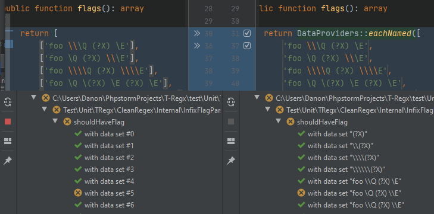

<p align="center"><a href="https://t-regx.com/"></a></p>

# Cross @dataProviders

Handy `require-dev` testing tool for [PhpUnit](https://github.com/sebastianbergmann/phpunit).

It allows you to create square matrices of your data providers!

[](https://github.com/T-Regx/CrossDataProviders/actions/)
[](https://coveralls.io/github/T-Regx/CrossDataProviders?branch=master)
[](https://github.com/T-Regx/CrossDataProviders)
[](https://github.com/T-Regx/CrossDataProviders)
[](https://github.com/T-Regx/CrossDataProviders/blob/master/LICENSE)
[](https://github.com/T-Regx/CrossDataProviders)

[][1]
[][1]
[][1]
[][1]
[][1]

[1]: https://github.com/T-Regx/CrossDataProviders/runs/2375602376

[](http://makeapullrequest.com)

1. [Installation](#installation)
    * [Composer](#installation)
2. [Examples](#examples)
3. [Pairs](#pairs)
3. [Each](#each)

# Installation

Installation for PHP 7.1 and later:

```bash
$ composer require --dev rawr/cross-data-providers
```

# Examples

Ever wanted to use multiple PhpUnit @dataProvider's with each other? Well, look no more :)

Imagine you have a service that allows you to log in to GitHub, BitBucket, SourceForge and GitLab with either SSH, HTTP or HTTPS and you want to test each **possible configuration of those**.

```php
/**
 * @test
 * @dataProvider services
 */
public function shouldLogin(string $service, string $method, int $port) {
    // given
    $login = new Login($method, $port);

    // when
    $result = $login->log($service);

    // then
    $this->assertTrue($result);
}

function services() {
    return DataProviders::cross(
      [
        ['github.com'],
        ['bitbucket.com'],
        ['gitlab.com'],
        ['sourceforge.net']
      ],
      [
        ['http', 80],
        ['https', 443],
        ['ssh', 22]
      ]
    );
}
```

This is equivalent of having a regular dataProvider that is composed of 12 entries, that look like this:
```php
function services() {
    return [
        ['github.com', 'http', 80],
        ['github.com', 'https', 443],
        ['github.com', 'ssh', 22],
        ['bitbucket.com', 'http', 80],
        ['bitbucket.com', 'https', 443],
        ['bitbucket.com', 'ssh', 22],
        ['gitlab.com', 'http', 80],
        ['gitlab.com', 'https', 443],
        ['gitlab.com', 'ssh', 22],
        ['sourceforge.net', 'http', 80],
        ['sourceforge.net', 'https', 443],
        ['sourceforge.net', 'ssh', 22],
    ];
}
```

## More advanced example

Let's say that apart from the domain and the protocol, you'd also like to add the protocol port, and the service title. Further more, you'd like to have three strategies of connection: lazy, eager and a test dry run.

```php
/**
 * @test
 * @dataProvider services
 */
public function shouldLogin(string $service, string $title, string $method, int $port, $strategy) {
    // given
    $login = new Login($method, $port);
    $login->useStrategy($strategy);

    // when
    $result = $login->log($service);

    // then
    $this->assertTrue($result, "Failed to login to $title");
}

function services() {
    return DataProviders::cross(
      [
        // First section (two paramters): $service and $title
        ['github.com',        'GitHub'],
        ['bitbucket.com',     'BitBucket'],
        ['gitlab.com',        'GitLab'],
        ['sourceforge.net',   'SourceForge'],
        ['www.gitkraken.com', 'Git Kraken']
      ],
      [
        // Second section: (pair of parameters): $method and $port
        ['http',  80],
        ['https', 443],
        ['ssh',   22]
      ],
      [
        // Last section: single parameter of $strategy
        new EagerStrategy(),
        new LazyStrategy(),
        new DryRunStrategy(),
      ]
    );
}
```

This is equal to a @dataProvider with 45 entries. The test will be run 45 times, each time with a unique combination of your sections :)

## DataProvider builder

The above example with `DataProviders::cross()`, can also be written with a help of a builder:

```php
function services() {
    return DataProviders::builder()
        ->addJoiningSection(
            ['github.com',        'GitHub'],
            ['bitbucket.com',     'BitBucket'],
            ['gitlab.com',        'GitLab'],
            ['sourceforge.net',   'SourceForge'],
            ['www.gitkraken.com', 'Git Kraken'])
        ->addJoiningSection(
            ['http',  80],
            ['https', 443],
            ['ssh',   22])
        ->addSection(
            new EagerStrategy(),
            new LazyStrategy(),
            new DryRunStrategy())
        ->build();
}
```

 - `addSection()` simply adds another iteration of parameters. This is usually the default behaviour, since joined
   sections appear quite rarely in most applications.
 - `addJoiningSection()` allows for specifying multiple arguments for your PhpUnit method, that are supposed to be
   present together, like `address` and `title` or a `protocol` and `port`.

---

The most common down-to-earth example could look similar to this:

```php
/**
 * @test
 * @dataProvider trimMethods
 */
public function shouldTrimWhitespace(string $strategy, string $whitespace) {
    // given
    $remover = new WhitespaceRemover($strategy);

    // when
    $result = $remover->remove($whitespace);

    // then
    $this->assertEmpty($result);
}

function trimMethods() {
    return DataProviders::builder()
        ->addSection('trim', 'preg_replace', 'str_replace', 'mb_str_replace')
        ->addSection(' ', '\t', '\n', '\r', PHP_EOL)
        ->build();
}
```

## Pairs

Sometimes, a square matrix of data providers is not what we need. Sometimes a more overall solution is need. What if
instead of `http`/`https` and `github`/`gitlab`/`bitbucket`/`sourceforge` that needed to be tested together,
there were file formats to be tested.

Let's say your brand new `FileConverter::convert()` method must convert any image type to any other image type, including
the same type again:

```php
/**
 * @test
 * @dataProvider formats
 */
public function shouldConvertFile(string $from, string $to) {
    // given
    $converter = new FileConverter();

    // when
    $result = $converter->convert($from, $to);

    // then
    $this->assertEquals($to, FormatUtils::detectFormat($result));
}

function formats() {
    return DataProviders::pairs('png', 'bmp', 'jpg', 'gif');
}
```

And that's it! It will mix and match every format (`'png'`, `'bmp'`, `'jpg'`, `'gif'`) and create pairs of each of those.

It is an equivalent of 16 data providers:
 - `['png', 'png']`, `['png', 'bmp']`, `['png', 'jpg']`, `['png', 'gif']`,
 - `['bmp', 'png']`, `['bmp', 'bmp']`, `['bmp', 'jpg']`, etc.

If you would like to ignore duplicate pairs (so to never convert from `png` to `png`), use `DataProviders::distinctPairs()`.

Currently, there is no key-mapper for `DataProviders::pairs()`, but please, create an issue for a key-mapper and I'll create
it shortly :)

## Each

A simplified version, for basic data providers

 - `each()`
    ```php
    function values() {
        return DataProviders::each([
           'One',
           'Two',
           'Three',
           'Four'
        ]);
    }
    ```

 - `eachNamed()`

    
